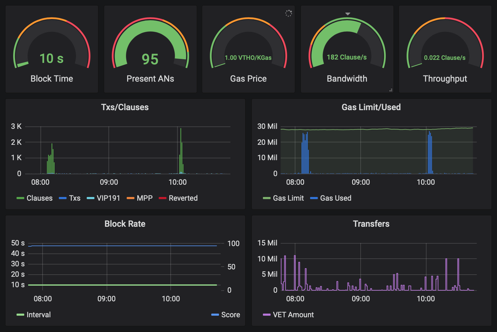

# VeStatus

Small script to build Influxdb measurement of VeChain blocks.

## Requirements

* A fully synchronized [VeChain node](https://github.com/vechain/thor)
* [Influxdb](https://www.influxdata.com/get-influxdb/) 1.x

## Installation

```
$ npm i -g @vechain/vestatus
```
## Startup

Suppose VeChain node and Influxdb are running locally and using default settings, then just:
```
$ vestatus
```

Or point to remote VeChain node or Influxdb:
```
$ vestatus <URL-of-VeChain-node-API> <URL-of-Influxdb>
```

If all things go well, you'll see something like:
```
connected to VeChain network: main
imported block 1023
```

## Dashboard

A prebuilt dashboard config file can be found at [./dashboard/model.json](dashboard/model.json). Import it into your Grafana and enjoy.



